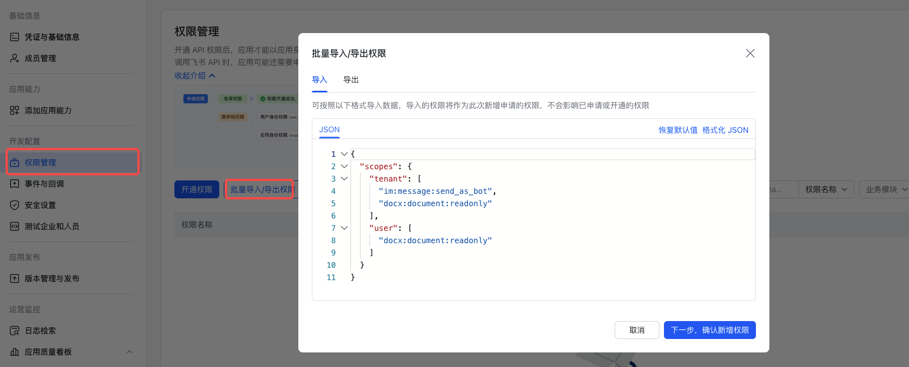
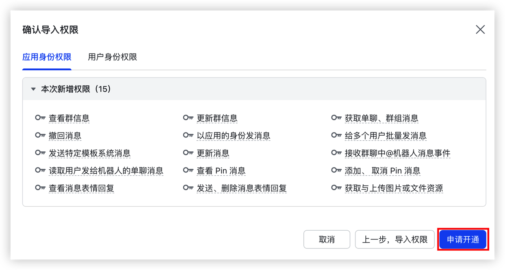
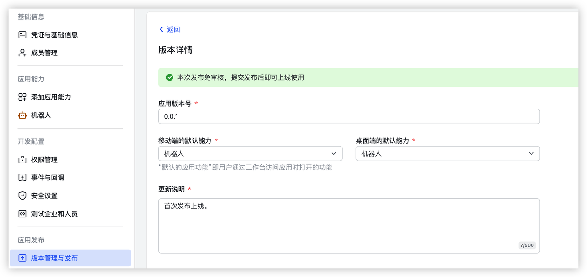
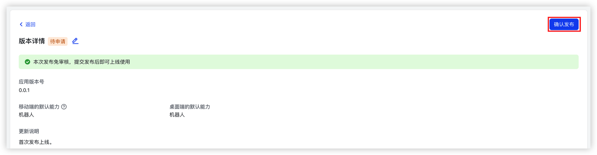
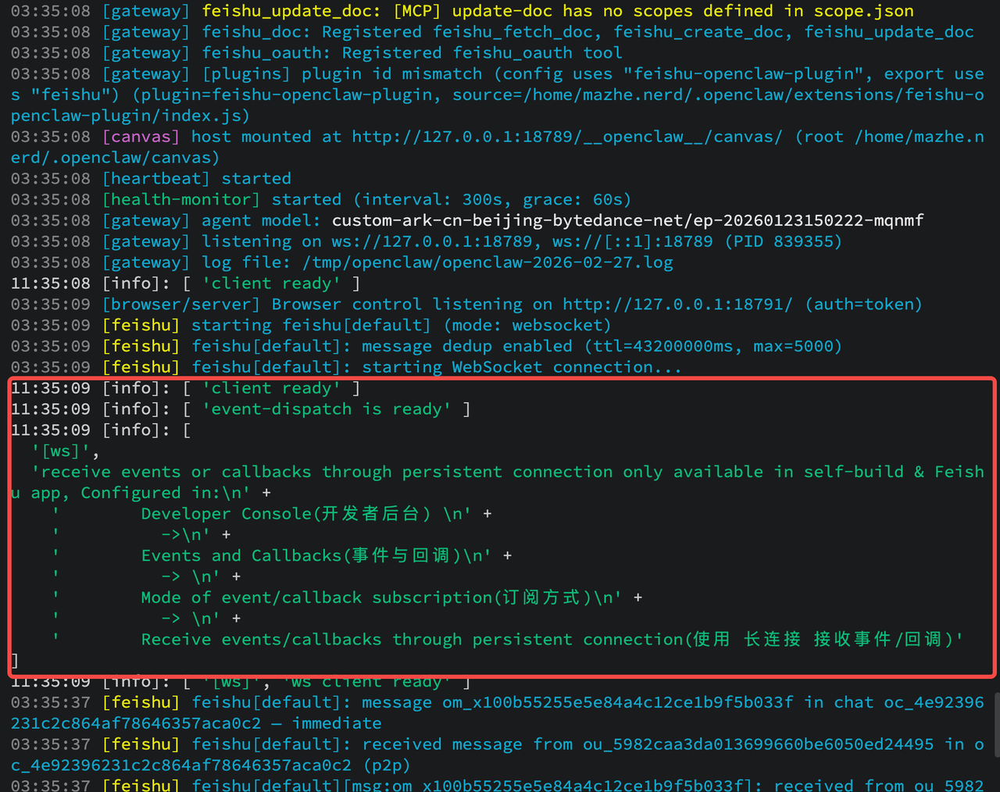
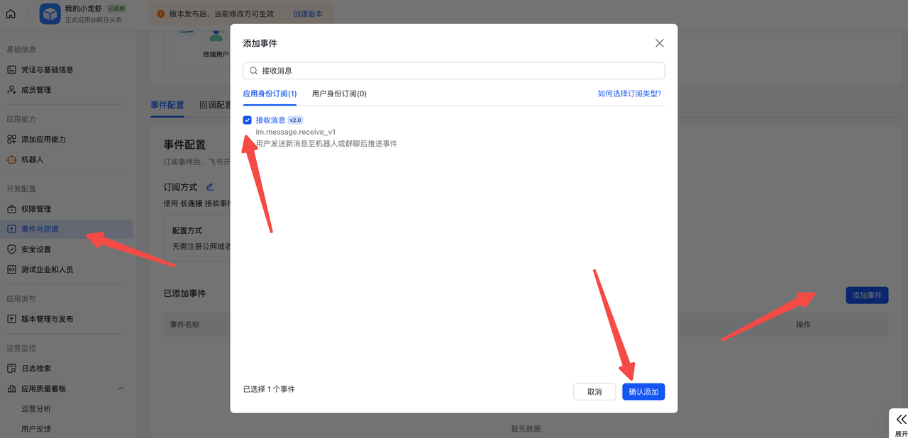

:::tip
 本文由openclaw自动生成
 :::
> 原文来源：https://www.feishu.cn/content/article/7613711414611463386
> 发布时间：2026-03-05
> 阅读时间：11分钟

---

## 一、什么是 OpenClaw？和其他 Agent 有什么不同？

[OpenClaw](https://openclaw.ai/) 是一款开源的个人 AI Agent 系统，可以运行在你的个人电脑或服务器上。相比以往的 AI Agent，OpenClaw 最大的不同在于：

- 它是**完全属于你的私人助理**
- 拥有**长期记忆**、能力持续进化
- 拥有**更高的权限**，能直接操作你电脑
- **本地运行**、还能 **24 小时主动干活**

---

## 二、什么是 OpenClaw 飞书官方插件？用起来能有多酷？

目前有大量用户主动将 OpenClaw 接入了飞书，得益于飞书各类协同工具和良好的开放能力，能够让你的 Agent 完成很多工作。

但早期 OpenClaw 上的三方飞书插件，可能遇到**服务不稳定**、**权限授权繁琐**等问题。

此次飞书推出的 **OpenClaw 官方插件** 能让你的 OpenClaw 以你的身份更好地调用飞书的各类能力，包括：

- 了解群聊和文档中的所有信息
- 写文档、改文档
- 帮你发消息
- 约日程
- 创建多维表格

**你说一句话，它就能伸出"钳子"，直接在飞书里帮你把活儿干了！**

### 完整能力一览

| 类别      | 能力                                        |
| ------- | ----------------------------------------- |
| 💬 消息   | 消息读取（群聊/单聊历史、话题回复）、消息发送、消息回复、消息搜索、图片/文件下载 |
| 📄 文档   | 创建云文档、更新云文档、读取云文档内容                       |
| 📊 多维表格 | 创建/管理多维表格、数据表、字段、记录（增删改查、批量操作、高级筛选）、视图    |
| 📅 日历日程 | 日历管理、日程管理（创建/查询/修改/删除/搜索）、参会人管理、忙闲查询      |
| ✅ 任务    | 任务管理（创建/查询/更新/完成）、清单管理、子任务、评论             |

### 相比其他平台的优势

- **vs Telegram**：飞书是国内的平台，有中文的界面、文档和客服，更容易上手
- **vs 其他国内平台**：飞书的开放能力更强，能获取更多工作中必要的上下文

> 💡 **总而言之，飞书是国内接入 OpenClaw 的最佳选择！**

---

## 三、OpenClaw 飞书官方插件安装步骤

> ⚠️ 飞书官方插件目前还在飞速迭代，每日都可能有新版本上新，请大家多多更新测试，多多反馈。
> ⚠️ 当前暂不支持 Windows，OpenClaw 已知 bug 还未解决

### 1. 安装前提

- ✅ 装好了 OpenClaw
- 推荐版本：**2026.2.26**，可通过 `openclaw -v` 命令查看

```bash
# 升级命令
npm install -g openclaw@2026.2.26
```

- ✅ 飞书机器人创建 & 权限开通完毕

### 2. 创建飞书应用

1. 登录[飞书开放平台](https://open.feishu.cn/app?lang=zh-CN)，单击"**创建企业自建应用**"按钮

2. 配置应用名、描述及图标，单击"创建"按钮

3. 添加机器人能力
   - 在左侧目录树选择"**应用能力 > 添加应用能力**"

   - 选择"**按能力添加**"页签，单击"**机器人**"能力卡片的"添加"按钮
   
### 3. 配置权限

在左侧目录树选择"**开发配置 > 权限管理**"，单击"**批量导入/导出权限**"按钮

在"导入"页签中，将如下权限替换原有示例：

```json
{
  "scopes": {
    "tenant": [
      "contact:contact.base:readonly",
      "docx:document:readonly",
      "im:chat:read",
      "im:chat:update",
      "im:message.group_at_msg:readonly",
      "im:message.p2p_msg:readonly",
      "im:message.pins:read",
      "im:message.pins:write_only",
      "im:message.reactions:read",
      "im:message.reactions:write_only",
      "im:message:readonly",
      "im:message:recall",
      "im:message:send_as_bot",
      "im:message:send_multi_users",
      "im:message:send_sys_msg",
      "im:message:update",
      "im:resource",
      "application:application:self_manage",
      "cardkit:card:write",
      "cardkit:card:read"
    ],
    "user": [
      "contact:user.employee_id:readonly",
      "offline_access",
      "base:app:copy",
      "base:field:create",
      "base:field:delete",
      "base:field:read",
      "base:field:update",
      "base:record:create",
      "base:record:delete",
      "base:record:retrieve",
      "base:record:update",
      "base:table:create",
      "base:table:delete",
      "base:table:read",
      "base:table:update",
      "base:view:read",
      "base:view:write_only",
      "base:app:create",
      "base:app:update",
      "base:app:read",
      "board:whiteboard:node:create",
      "board:whiteboard:node:read",
      "calendar:calendar:read",
      "calendar:calendar.event:create",
      "calendar:calendar.event:delete",
      "calendar:calendar.event:read",
      "calendar:calendar.event:reply",
      "calendar:calendar.event:update",
      "calendar:calendar.free_busy:read",
      "contact:contact.base:readonly",
      "contact:user.base:readonly",
      "contact:user:search",
      "docs:document.comment:create",
      "docs:document.comment:read",
      "docs:document.comment:update",
      "docs:document.media:download",
      "docs:document:copy",
      "docx:document:create",
      "docx:document:readonly",
      "docx:document:write_only",
      "drive:drive.metadata:readonly",
      "drive:file:download",
      "drive:file:upload",
      "im:chat.members:read",
      "im:chat:read",
      "im:message",
      "im:message.group_msg:get_as_user",
      "im:message.p2p_msg:get_as_user",
      "im:message.send_as_user",
      "im:message:readonly",
      "search:docs:read",
      "search:message",
      "space:document:delete",
      "space:document:move",
      "space:document:retrieve",
      "task:comment:read",
      "task:comment:write",
      "task:task:read",
      "task:task:write",
      "task:task:writeonly",
      "task:tasklist:read",
      "task:tasklist:write",
      "wiki:node:copy",
      "wiki:node:create",
      "wiki:node:move",
      "wiki:node:read",
      "wiki:node:retrieve",
      "wiki:space:read",
      "wiki:space:retrieve",
      "wiki:space:write_only"
    ]
  }
}
```

### 4. 发布应用

1. 单击顶部的"**创建版本**"按钮
2. 按需配置应用版本号、默认能力及更新说明等信息
3. 单击页面底部的"**保存**"按钮
4. 单击页面右上角的"**确认发布**"按钮

### 5. 获取配置信息

在左侧目录树选择"**基础信息 > 凭证与基础信息**"，获取 **App ID** 与 **App Secret**

### 6. 安装插件
> 如果历史上已安装了其他飞书插件，在这一步安装过程中将会**自动禁用**其他飞书插件，无需额外处理；如果你所在的平台有辅助开发 Agent ，可以试试让Agent辅助安装。
> 
> 但如果您安装飞书官方插件后再升级 OpenClaw 版本，需要手动禁用其他飞书插件。

依次在终端中执行以下命令：
###### Linux/MacOS

```bash
# 设置 npm 镜像
npm config set registry https://registry.npmjs.org

# 下载插件
curl -o /tmp/feishu-openclaw-plugin-onboard-cli.tgz https://sf3-cn.feishucdn.com/obj/open-platform-opendoc/4d184b1ba733bae2423a89e196a2ef8f_QATOjKH1WN.tgz

# 安装
npm install /tmp/feishu-openclaw-plugin-onboard-cli.tgz -g

# 清理
rm /tmp/feishu-openclaw-plugin-onboard-cli.tgz

# 安装插件
feishu-plugin-onboard install
```

按照提示填入 App ID 和 App Secret
###### Windows cmd

```
npm config set registry https://registry.npmjs.org
```

```
curl -o "%TEMP%\feishu.tgz" https://sf3-cn.feishucdn.com/obj/open-platform-opendoc/c53145d7b9eb0e29f4e07bf051231230_XjCy46mAFI.tgz
```

```
npm install -g "%TEMP%\feishu.tgz"
```

```
del "%TEMP%\feishu.tgz"
```

```
feishu-plugin-onboard install
```
### 7. 运行 OpenClaw

```bash
openclaw gateway run
```
出现下面这段说明插件已经开始监听飞书的事件，启动成功。
### 8. 订阅机器人长链接接收事件

1. 配置事件订阅方式
2. 添加接收消息事件
3. 发布版本

### 9. 完成配对

1. 在飞书中向机器人发送任意消息，系统会生成配对码（有效期5分钟）
2. 在服务器执行：`openclaw pairing approve feishu --notify`
3. 完成授权

> 🌰 如果希望快速完成权限授权，可以告诉AI："我想授予所有用户权限"

### 10. 确认安装成功

- 输入 `/feishu start` 查看版本号
- 告诉AI："学习一下我安装的新飞书插件，列出有哪些能力"

---

## 四、OpenClaw 飞书官方插件使用注意事项

### 如何更新插件？

```bash
feishu-plugin-onboard update
```

### 遇到问题怎么办？

| 命令 | 作用 |
|------|------|
| `/feishu start` | 确认是否安装成功 |
| `/feishu doctor` | 检查配置是否正常 |
| `/feishu auth` | 批量完成用户授权 |

### 调试命令

```bash
# 查看问题
feishu-plugin-onboard doctor

# 自动修复
feishu-plugin-onboard doctor --fix

# 查看版本信息
feishu-plugin-onboard info

# 查看详细配置
feishu-plugin-onboard info --all
```

### 流式输出配置

```bash
# 开启流式输出
openclaw config set channels.feishu.streaming true

# 关闭流式输出
openclaw config set channels.feishu.streaming false

# 开启耗时显示
openclaw config set channels.feishu.footer.elapsed true

# 开启状态展示
openclaw config set channels.feishu.footer.status true
```

---

## 五、OpenClaw 飞书官方插件安装常见问题

### 1. 插件安装完毕运行后，报 cannot find module xxx？

**原因**：系统没有安装插件的依赖（可能是安装被中断或权限问题）

**解决方法**：进入插件安装目录，运行 `npm install`

### 2. 如何切换到流式输出？

```bash
# 开启
openclaw config set channels.feishu.streaming true

# 关闭
openclaw config set channels.feishu.streaming false
```

### 3. 如何修改飞书机器人在群内的回复方式？

| 模式 | 效果 | 配置 |
|------|------|------|
| 模式 1 | 只有 @机器人才回复 | `requireMention: true` |
| 模式 2 | 所有消息都回复 | `requireMention: "open"` 或 `false` |
| 模式 3 | 指定群 @机器人才回复 | groups 里单独配置 |

**常用命令：**

```bash
# 查看当前配置
openclaw config get channels.feishu

# 设置需要 @ 才回复
openclaw config set channels.feishu.requireMention true --json

# 设置不需要 @ 也回复
openclaw config set channels.feishu.requireMention open --json

# 给特定群设置规则
openclaw config set channels.feishu.groups.群ID.requireMention true --json
```

### 4. 如果之前已安装过飞书 MCP

需要移除，避免使用冲突。可以和 AI 对话："移除飞书MCP"

---

## 六、结语

**OpenClaw 的价值不在"会回答"，而在"能把事办完"。**

当它和飞书通过官方插件连起来，文档、消息、日历这些真正承载工作的信息流，就不需要你再一趟趟搬运了——你只要下达目标，它就能在飞书里完成动作。

快去飞书里把 OpenClaw 官方插件装起来，按本文步骤完成授权和安装，挑一件你最讨厌、最重复的活儿交给它试试吧！

---

> 相关链接：
> - [OpenClaw 官网](https://openclaw.ai/)
> - [飞书开放平台](https://open.feishu.cn/)
> - [安装问题反馈](https://github.com/openclaw/openclaw/issues/7631)
